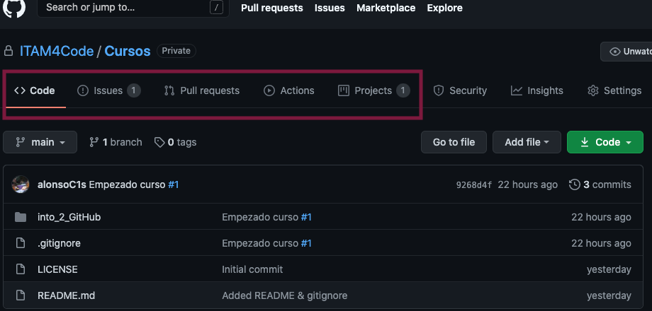

# Como vamos a trabajar en GitHub

Si bien git por sí solo permite colaborar de manera ágil con miles de
personas en todo el mundo, GitHub no solo provee una plataforma para
alojar el código sino que da una variedad de herramientas que
facilitan la construcción colaborativa de software de calidad. En ITAM
For Code queremos utilizar estas herramientas para trabajar entre
nosotros y para contribuir a proyectos open source mucho más grandes.
Algunas de las cosas en las que nos estaremos enfocando son: _issues_,
_pull requests_, _milestones_ y _projects_.

Cada _repo_ puede tener asociados sus propios _issues_, etc... Puedes
encontrar la pestaña para accesarlos en la página principal del _repo_
como se muestra en la foto:

