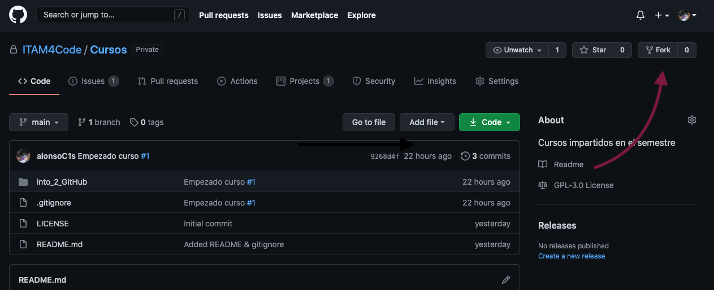

# ¿Qué es un _fork_?

Un _fork_ es una copia exacta de un _repo_, con algunas
particularidades. Al hacer un _fork_ de un _repo_ en GitHub estás
copiando el contenido entero del _repo_ junto con todo el historial de
cambios que se han hecho. Además, el _fork_ nuevo está configurado por
default para que puedas incorporar los cambios más recientes que se le
hayan hecho al _repo_ original si deseas mantener tu trabajo al día,
pero también para guardar tus modificaciones personales y subirlas a
GitHub sin permiso del dueño del repo original. ¡Es tu propio _repo_!

Usualmente hacemos _forks_ por varias razones. Una de ellas, es
contribuir a un proyecto Open Source que le pertenece a alguien más.
Para poder modificar el código el dueño de ese _repo_ debería dar
permiso explícito a todas y cada una de las personas que quieran
aportar, lo cual no es práctico. Entonces, para sugerir cambios
podemos hacer un _fork_ del original, modificarlo, y proponer que se
incorporen los cambios al original mediante un _pull request_.
Hablaremos con mucho más detalle de _pull request_ más tarde.
Otra razón igual de válida para crear un _fork_ es crear una versión
propia y personalizada del proyecto original. Si los cambios pueden
ser útiles para otras personas puedes proponer que se incorporen al
original. Y si no lo son y los dueños de ese repo deciden que no
quieren incorporarlo, ¡puedes tener tu propia versión! Es una de las
bondades del open source[^1]

[^1]: Esto pasa con relativa frecuencia. Por ejemplo Vim y Neovim.

## ¿Cómo hago un _fork_?

El primer paso para hacer un _fork_ es identificar qué _repo_ quieres
"_forkear_". Por ejemplo, puedes intentar con el código fuente de
estas mismas [notas](https://github.com/ITAM4Code/Cursos)! En la
página encontrarás algo similar a la imagen de abajo.

Para hacer un fork, da click a el botón que dice "fork" (el que tiene
una flecha roja en la imagen anterior). Cuando lo hagas verás una
pantalla similar a la imagen siguiente.

Espera unos segundos más y verás una página idéntica a la principal
del repo que acabas de clonar. Pero no es la misma! Esta es la página
de tu propio _fork_, lo podrás notar porque abajo del título ahora hay
una leyenda que dice "forked from ...".
