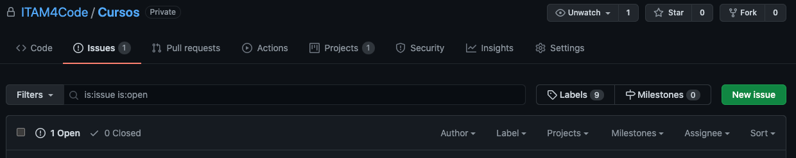
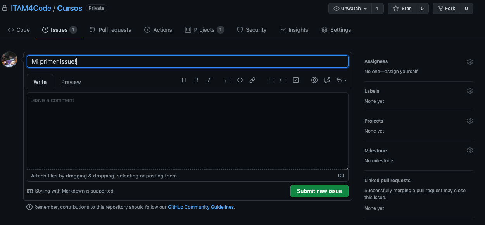

# Issues

> Every non-trivial program contains at least one bug
>
> --Murphy computer laws

Cuando se comparte software, es casi una garantía que la comunidad que
lo usa va a encontrar _bugs_ (o errores) en el funcionamiento del
código. Lo mejor que se puede hacer en estos casos es informar a quien
se encarga de dar mantenimiento al proyecto, pero hacerlo por ejemplo
por emails individuales es muy ineficiente. ¿Qué pasa si yo encuentro
un _bug_ que ya fue descubierto hace semanas y lo reporto? Estaré
duplicando información y haciendo más dificil arreglarlo.

Para mantener toda la información organizada para quien trabaje en el
proyecto y las personas que lo usan hacemos _issues_ en el repo. Los
_issues_ sirven como reportes con toda la inforamción que podría
ayudar a resolver el problema, y además también son útiles para los
usarios ya que pueden buscar ahí un problema que hayan tenido y quizás
ahi esté la solución[^1]. Los _issues_ se pueden crear por muchas
razones. Por ejemplo para reportar erroes, comportamiento inesperado,
o incluso para pedir que se agreguen cosas que nos gustaría usar. Por
ahora nos enfocaremos en reportar errores.

[^1]: Pro tip: Si estás usando software open source y te encuentras
  con un _bug_ es muy buena idea empezar a buscar soluciones en la
  pestaña de bugs en el repo que tiene el código fuente. Es posible
  que encuentres la solución, y si no es asi, podrás crear un reporte.
  Eso también es ayudar a la comunidad!

## ¿Cómo creo un _issue_?

Para crear un _issue_ pues dar click a la pestaña issues en la página
princial del repo. Ahi verás una pantalla como la siguiente:

Si das click en el botón verde enorme que dice "New Issue" podrás ver
la pantalla siguiente y ahi empezar a llenar un reporte[^2].

[^2]: Algunos repos te mostrarán una pequeña página con _templates_ de
  issues. Si los usas y llenas la información qu te piden podrás
  ayudar aún mejor a que se resuelva el problema.

El la parte izquierda podrás elegir un título y llenar más
información. Trata de elegir un título corto pero ilustrativo. Abajo
del título puedes hacer comentarios más extensos, y en muchas
ocasiones se pide que se de mucha información. Puedes incorporar
código, listas, links, y todo lo que permite
[markdown](https://github.com/adam-p/markdown-here/wiki/Markdown-Cheatsheet).
Incluso puedes hacer referencia a otros _issues_ por su número de
_issue_, mencionar personas o equipos con @, o hace referencia a
commit con su número de hash[^3].

[^3]: Un número de hash es un código alfanumérico que identifica
  únicamente a un commit específico. Qué es un commit y qué es un hash
  se discuten con más claridad en las notas de git. Por ahora basta
  con pensar en un _commit_ como una versión específica del código.

En la parte derecha de la pantalla vemos las mismas opciones que las
discutidas en la sección sobre _pull requests_. Salvo que ahora
estamos ligando _issues_ a _pull request_ y no al revés.

## ¿Cómo marco un issue como resuelto?

En esencia hay dos maneras de resolver un issue:

1. Cerrarlo mediante un _pull request_
2. Cerrarlo manualmente

La primera opción es sencilla conceptualmente. Si el _issue_ actual
fue mencionado en un _pull request_, y ese recibe aprobación de
_merge_ entonces el _issue_ se cerrará automáticamente. Esto también
se puede hacer haciendo el mensaje de _commit_ algo del estilo
`closes` o `fixes` seguido de `#n` donde _n_ es el número de _issue_
que se puede ver al lado de su título en la página de _issues_. Cada
_issue_ y _pull request_ se numera en orden sucesivo a medida que se
crea.

Para cerrar un _issue_ manualmente el proceso es muy simple. Al final
de todos los comentarios hay un botón rojo que dice algo como "close
issue". Esto solo se puede hacer si tienes permisos de escritura sobre
el _repo_. Es decir, si formas parte del equipo al cual le pertenece o
si tienes invitación para colaborar.
