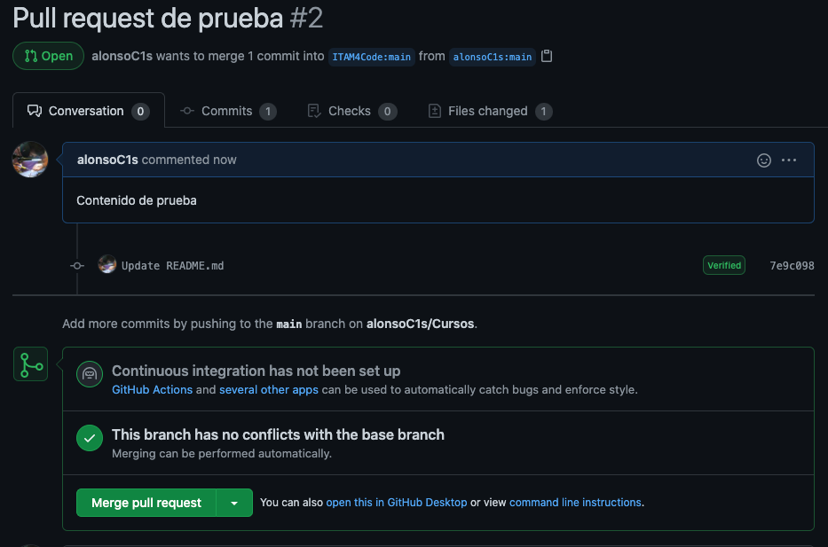

# Pull Requests

Los _pull requests_ son el concepto más importante de este capítulo.
Si no puedes leer el resto del capítulo, es indispensable que leas por
lo menos esta sección.

Los _pull requests_, como su nombre sugiere, son peticiones que hace
una persona que hizo cambios a un repo para que las personas
encargadas del mantenimiento lo revisen y quizás incorporen los
cambios al código principal. Los pull requests se pueden hacer por
personas con permisos de modificar el código directamente, o por
personas que hayan hecho un _fork_ del _repo_ porque no tienen ese
permiso. Para las personas con permisos pueden ser una petición al
resto del equipo para que revisen su código y aprueben los cambios
hechos. Para las personas que hacen un _pull request_ mediante un
_fork_ es una prupuesta para incorporar sugerencias. Por ejemplo para
resolver un _issue_ creado o proponer nueva funcionalidad.

## ¿Cómo crear un _pull request_?

Esta guía está enfocada a la creación de _pull requests_ mediante
_forks_ porque es un caso de uso más común. Para eso, se necesita
tener un _fork_ listo. Retomamos el ejemplo de _fork_ en los primeros
capítulos de la guía. Digamos que después de haber clonado
`ÌTAM4Code/Cursos`, haberlo clonado, y hacer cambios a él[^1], una vez
sincronizado GitHub, aparecerá una pantalla similar a la siguiente en
la página principal del _repo_.

[^1]: Esto puede sonar muy vago, y lo es. Los detalles de cómo clonar,
  modificar y "sincronizar" cambios con GitHub están en la guía
  específica de git.

En el área marcada con el rectángulo rojo se encuentra el área en la
que se muestra el mensaje de confirmación de los cambios más
recientes. En este caso, GitHub sabe que este _repo_ es un _fork_ de
otro repo, y además nota que están en versiones distintas. En este
caso el _fork_ está adelantado al original. Es decir, hay cambios en
el _fork_ que no están en el original, y por lo tanto se puede hacer
un pull request. Y efectivamente, en el lado derecho del recuadro
GitHub da un botón para crear uno nuevo. Al hacer click se puede ver
la siguiente pantalla:

En esta primera pantalla GitHub muestra una comparación de los cambios
en el _fork_ vs. el original. Si no hay conflictos[^2] GitHub dará la
opción de crear un Pull Request y se puede continuar el proceso dando
click al botón verde.

[^2]: Otro concepto que se explora más en la guía de git

En este paso vemos dos áreas para llenar información, una a la derecha
y otra a la izquierda. En la izquierda se puede llenar el título del
_pull request_ y el resto de información relevante. En la sección
sobre _issues_ detallamos un poco más sobre qué se puede incluír en
esta sección.

Del lado derecho hay una variedad de opciones:

1. Assignees
2. Labels
3. Projects
4. Milestones
5. Issues

Sin muchos detalles, esto es lo que cada campo se refiere:

1. Permite asignar personas o equipos específicos para que revisen
   este _issue_ en particular. Usualmente esto está reservado para las
   personas que administran el _repo_.

2. Los _labels_ son etiquetas que se dan al issue. Como se mencionaba
   un issue puede referirse a muchas cosas y esto ayuda a organizar
   _issues_ de la misma categoría. Puedes dar click y explorar las
   opciones, es común que cada proyecto decida qué labels quiere usar.

3. Los proyectos son tableros que permiten catalogar _issues_ en
   categorías como: por hacer, en progreso, y resueltas. Se hablará
   más de los proyectos más tarde.

4. Los _milestones_ son listas que se pueden crear con issues
   espcíficos ordenados por prioridad. Se crean cuando se tiene un
   deadline en mente y se quiere ir revisando el progreso.

5. Se pueden resolver _issues_ mediante _pull requests_. Si un _pull
   request_ culmina con éxito, el _issue_ asociado se resolverá.

## ¿Cómo cerrar un _pull request_?

Una vez creado un _pull request_ aparecerá en la pestaña de _pull
requests_ en la página principal del _repo_. Si se da click sobre uno
en específico se puede ver una pantalla como esta:

Aqui se pueden revisar los cambios dando click en las pestañas de
Commits o Files Changed. GitHub mostrará una página de comparación
entre el código del _fork_ y el original. En la página principal se
pueden hacer comantarios con respecto a los cambios, y sugerir otras
modificaciones para poder aceptar el _pull request_. Si después de ese
proceso se desea hacer _merge_, se puede dar click al botón verde
marcado para eso. En caso de que se rechacen los cambios se puede
cerrar sin hacer _merge_

Nota: _Merge_ es un término particular de git. Se usa para referirse
al proceso de mezclar dos versiones distintas de código a un destino.
En este caso, a el _repo_ original.
