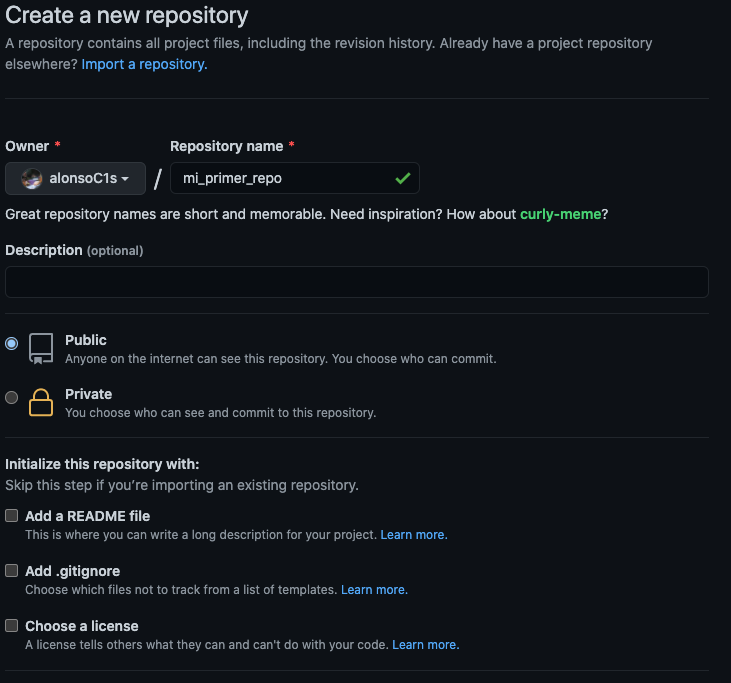

## Qué es un _repo_?

_Repo_ es una abreviación de _repository_, que se traduce a
repositorio. Un repositorio se puede pensar como una "carpeta" en la
que se guarda todo lo relacionado a un proyecto. El concepto de repo
viene de git, y se mantiene en GitHub, y es uno de los objetos básicos
de trabajar con git y GitHub. Un _repo_ puede ser propiedad de un
usuario o de una organización o equipo dentro de ésta. La manera en la
que estaremos trabajando es con _repos_ que pertenecen a la
organización que creamos para colaborar.

Algunas de las operaciones básicas de git que se pueden hacer sobre
repos son:

- Clonar
- "Forkear"
- Modificar

Todas estas se explicarán con más detalle a continuación.

### ¿Cómo creo un nuevo _repo_?

Al entrar a GitHub podrás ver la barra principal del sitio en la parte
más alta de la pantalla como se muestra en la foto.

En la parte derecha de la barra de navegación podrás encontrar tu foto
de perfil, y a su lado izquierdo un botón "+". Al darle click podrás
ver la siguiente pantalla:

Haz click en "New Repository" y podrás ver la siguiente página:

Por ahora, solo tienes que darle un nombre. Las demás opciones de
configuración por ahora no hacen falta, las discutiremos más tarde.

Para empezar a modificar este _repo_ puedes clonarlo a tu computadora
y así tendrás una copia la cual puedes modificar y más tarde
sincronizar con GitHub. El proceso de clonación se cubre con mucho más
detalle en las notas dedicadas a git.
